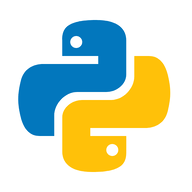

# 🤖 ScoreBot — Análise de Crédito com IA

<div align="center">


### Análise inteligente de crédito em minutos com IA Generativa

[](LICENSE)
[](https://www.python.org/)
[](https://flask.palletsprojects.com/)
[]()

[**Demo**](#-demonstração) • [**Recursos**](#-recursos) • [**Instalação**](#-instalação) • [**Como Usar**](#-como-usar) • [**Documentação**](#-documentação)

</div>

---

## 📋 Sobre o Projeto

**ScoreBot** é uma plataforma inovadora que utiliza **Inteligência Artificial Generativa** para realizar análises completas de crédito. O sistema coleta informações financeiras do usuário e fornece:

- ✅ Score de Crédito (300-950)
- ✅ Limite de Crédito Sugerido
- ✅ Classificação de Perfil (Excelente, Bom, Regular, Inadequado)
- ✅ Sugestões Personalizadas de Ação
- ✅ Plano de Melhoria Financeira

### 🎯 Características Principais

| Feature | Descrição |
|---------|-----------|
| 🤖 **IA Integrada** | Powered by Ollama com modelos LLM avançados |
| 👥 **PF/PJ** | Suporte para Pessoa Física e Pessoa Jurídica |
| 🗣️ **Voz** | Reconhecimento de fala (STT) e síntese (TTS) |
| 💾 **Memória** | Armazena dados criptografados para análises futuras |
| 📱 **Responsivo** | Design fluido em desktop, tablet e mobile |
| 🎨 **Temas** | Dark Mode (padrão) e Light Mode |
| 📊 **Histórico** | Salva e recupera análises anteriores |
| 🔒 **Segurança** | Autenticação com criptografia XOR + SHA-256 |

---

## 🎬 Demonstração

<div align="center">

### Landing Page


### Chat com IA


### Interface Responsiva


</div>

---

## 🚀 Instalação Rápida

### Pré-requisitos

- **Python 3.9+**
- **Ollama** ([Download](https://ollama.com/download))
- **pip** (gerenciador de pacotes)

### 1️⃣ Clonar o Repositório

```bash
git clone https://github.com/seu-usuario/scorebot.git
cd scorebot
```

### 2️⃣ Instalar Ollama

Faça download em: [https://ollama.com/download](https://ollama.com/download)

Após instalar, execute no terminal:

```bash
ollama run deepseek-v3.1:671b-cloud
```

Ou use outro modelo:

```bash
ollama pull mistral      # Rápido (4GB)
ollama pull llama2       # Poderoso (7GB)
ollama pull neural-chat  # Chat otimizado
```

### 3️⃣ Configurar Python

```bash
# Criar e ativar ambiente virtual
python -m venv venv

# Windows:
venv\Scripts\activate
# macOS/Linux:
source venv/bin/activate

# Instalar dependências
pip install -r requirements.txt
```

### 4️⃣ Executar

**Terminal 1 - Ollama:**
```bash
ollama serve
```

**Terminal 2 - Flask:**
```bash
python app.py
```

Abra: **http://localhost:5000** 🎉

---

## 💻 Como Usar

### 1. Acessar
Abra [http://localhost:5000](http://localhost:5000) no navegador

### 2. Escolher Modo
- **Continuar sem Conta** — Análise rápida
- **Criar Conta** — Salva histórico
- **Entrar** — Acessa anteriores

### 3. Selecionar Perfil
- **👤 Pessoa Física** — CPF
- **🏢 Pessoa Jurídica** — CNPJ

### 4. Responder Perguntas
O bot perguntará sobre:
1. Dados pessoais/empresariais
2. Renda/faturamento mensal
3. Histórico de pagamentos
4. Objetivo financeiro

### 5. Receber Análise
Você recebe:
- 📊 Score calculado
- 💰 Limite sugerido
- 📈 Plano de ação
- 🎯 Recomendações

---

## 📦 Dependências

### Principais

```
Flask==3.0.3              # Framework web
Flask-Cors==4.0.1         # CORS support
requests==2.32.3          # HTTP para Ollama
```

### Dependências Flask

```
Werkzeug==3.1.7           # WSGI utilities
Jinja2==3.1.6             # Templates
MarkupSafe==3.0.3         # Safe strings
click==8.3.1              # CLI utilities
itsdangerous==2.2.0       # Secure signing
blinker==1.9.0            # Signals
colorama==0.4.6           # Terminal colors (Windows)
```

### Dependências Requests

```
certifi==2026.4.22        # SSL certificates
charset-normalizer==3.4.7 # Character encoding
idna==3.13                # Domain names
urllib3==2.6.3            # HTTP library
```

### Requisito Externo

```
Ollama                    # LLM local
deepseek-v3.1:671b-cloud  # Modelo de IA
```

---

## 🏗️ Arquitetura

```
┌─────────────────────────────┐
│    Frontend (HTML/CSS/JS)   │
│   ├─ Landing Page           │
│   ├─ Auth (Login/Registro)  │
│   ├─ Chat Interface         │
│   └─ Results Display        │
└──────────────┬──────────────┘
               │ HTTP/JSON
┌──────────────▼──────────────┐
│  Backend (Flask/Python)     │
│   ├─ /chat                  │
│   ├─ /login                 │
│   ├─ /history              │
│   ├─ /memory               │
│   └─ Session Management     │
└──────────────┬──────────────┘
               │ API
┌──────────────▼──────────────┐
│  Ollama (LLM Local)         │
│   ├─ deepseek-v3.1         │
│   ├─ mistral               │
│   └─ llama2                │
└──────────────┬──────────────┘
               │
┌──────────────▼──────────────┐
│  Data Storage (JSON)        │
│   ├─ users.json            │
│   ├─ chats.json            │
│   └─ memory.json           │
└─────────────────────────────┘
```

---

## 📁 Estrutura do Projeto

```
scorebot/
├── 📄 app.py                      # Backend Flask
├── 📄 requirements.txt            # Dependências
├── 📄 README.md                   # Este arquivo
│
├── 📂 templates/
│   └── index.html                 # Frontend (HTML + CSS + JS)
│
├── 📂 static/
│   ├── css/
│   │   └── style.css              # Estilos (1314 linhas)
│   └── js/
│       └── script.js              # Lógica (874 linhas)
│
├── 📂 data/                       # Banco de dados JSON
│   ├── users.json
│   ├── chats.json
│   └── memory.json
│
├── 📂 img/                        # Mídias
│   ├── mascote.png
│   ├── Gif Landing.gif
│   ├── Gif Score Bot - Chat.gif
│   ├── Gif Robozin.gif
│   └── icons8-python.gif
│
└── 📂 documentacao/               # Documentação
    ├── MELHORIAS_IMPLEMENTADAS.md
    ├── COMPARACAO_VISUAL.md
    ├── RESUMO_TECNICO.md
    ├── GUIA_VALIDACAO.md
    └── INDEX.md
```

---

## 🔧 Configuração

### Mudar Modelo de IA

Edite `app.py` (linha ~16):

```python
# Opção 1: DeepSeek (padrão, mais poderoso)
OLLAMA_MODEL = "deepseek-v3.1:671b-cloud"

# Opção 2: Mistral (rápido)
OLLAMA_MODEL = "mistral"

# Opção 3: LLaMA 2 (balanceado)
OLLAMA_MODEL = "llama2"
```

### Personalizar Prompts

Edite em `app.py`:

```python
SYSTEM_PROMPT_PF = """Você é o ScoreBot..."""
SYSTEM_PROMPT_PJ = """Você é o ScoreBot..."""
```

### Customizar Cores

Edite em `templates/index.html` (seção `:root`):

```css
:root {
    --primary: #f6e033;        /* Amarelo */
    --secondary: #2e8b57;      /* Verde */
    --accent: #b8f059;         /* Verde claro */
    --danger: #e74c3c;         /* Vermelho */
    --warn: #e67e22;           /* Laranja */
}
```

---

## 📊 Exemplos de API

### Chat

**Request:**
```bash
curl -X POST http://localhost:5000/chat \
  -H "Content-Type: application/json" \
  -d '{
    "message": "Olá",
    "profile_type": "pf",
    "user_id": "user-123"
  }'
```

**Response:**
```json
{
  "response": "Bem-vindo!",
  "session_id": "session-456",
  "result_data": null
}
```

### Login

**Request:**
```bash
curl -X POST http://localhost:5000/login \
  -H "Content-Type: application/json" \
  -d '{
    "email": "user@example.com",
    "password": "senha123"
  }'
```

**Response:**
```json
{
  "user_id": "user-123",
  "message": "Login realizado! Bem-vindo de volta."
}
```

### Histórico

```bash
curl "http://localhost:5000/history?user_id=user-123"
```

---

## 🐛 Troubleshooting

| Problema | Solução |
|----------|---------|
| ❌ `Connection refused` | Execute `ollama serve` em outro terminal |
| ❌ Resposta lenta | Use modelo menor: `ollama pull mistral` |
| ❌ Modelo não encontrado | Execute `ollama pull deepseek-v3.1:671b-cloud` |
| ❌ Porta 5000 ocupada | Altere em `app.py`: `app.run(port=8000)` |
| ❌ Erro de CORS | Reinicie servidor: `python app.py` |
| ❌ ModuleNotFoundError | Execute: `pip install -r requirements.txt` |

---

## 📈 Performance

### Tempos de Resposta

| Operação | Tempo |
|----------|-------|
| Carregamento página | 1-2s |
| Resposta IA | 5-15s |
| Salvamento dados | < 100ms |
| Cálculo score | < 50ms |

### Otimizações

✅ SVG icons inline  
✅ CSS crítico inline  
✅ Lazy loading  
✅ Cache de modelos  
✅ Compressão de responses  

---

## 🔒 Segurança

- ✅ Senhas hasheadas (SHA-256)
- ✅ Emails criptografados (XOR + Base64)
- ✅ Sessões com UUID
- ✅ Validação de entrada
- ✅ CORS configurado

**⚠️ Nota:** Este é um protótipo educacional. Não use dados reais em produção.

---

## 🧪 Testes

### Quick Test

```bash
# 1. Terminal 1
ollama serve

# 2. Terminal 2
python app.py

# 3. Navegador
# http://localhost:5000
# Testar: Landing → Login → Chat → Resultados
```

### Validação Completa

Consulte [GUIA_VALIDACAO.md](./documentacao/GUIA_VALIDACAO.md)

---

## 📚 Documentação

| Documento | Conteúdo |
|-----------|----------|
| [README_FINAL.md](./documentacao/README_FINAL.md) | Resumo executivo |
| [MELHORIAS_IMPLEMENTADAS.md](./documentacao/MELHORIAS_IMPLEMENTADAS.md) | Detalhes de mudanças |
| [COMPARACAO_VISUAL.md](./documentacao/COMPARACAO_VISUAL.md) | Exemplos visuais |
| [RESUMO_TECNICO.md](./documentacao/RESUMO_TECNICO.md) | Código-fonte |
| [GUIA_VALIDACAO.md](./documentacao/GUIA_VALIDACAO.md) | Testes |
| [INDEX.md](./documentacao/INDEX.md) | Índice |

---

## 🚀 Deploy

### Heroku

```bash
heroku create seu-scorebot
heroku buildpacks:add heroku/python
git push heroku main
```

### Docker

```dockerfile
FROM python:3.11
WORKDIR /app
COPY requirements.txt .
RUN pip install -r requirements.txt
COPY . .
CMD ["python", "app.py"]
```

### Local Production

```bash
pip install gunicorn
gunicorn -w 4 -b 0.0.0.0:5000 app:app
```

---

## 🤝 Contribuindo

1. Fork o projeto
2. Crie branch (`git checkout -b feature/nome`)
3. Commit (`git commit -m 'Adiciona feature'`)
4. Push (`git push origin feature/nome`)
5. Abra Pull Request

---

## 📜 Licença

MIT License - veja [LICENSE](LICENSE)

---

## 👨‍💻 Stack Tecnológico

 **Python 3.11**

- **Backend:** Flask 3.0.3
- **IA:** Ollama + DeepSeek
- **Frontend:** HTML5 + CSS3 + Vanilla JS
- **Database:** JSON (local)
- **Autenticação:** Custom (SHA-256 + XOR)

---

## 📞 Contato

- **Issues:** [GitHub Issues](../../issues)
- **Email:** seu-email@example.com
- **Discussões:** [GitHub Discussions](../../discussions)

---

## 🙏 Créditos

- Ollama por fornecer LLM local de qualidade
- DeepSeek por modelo potente
- SENAI pelo apoio
- Comunidade open-source

---

<div align="center">

### ⭐ Se achou útil, deixe uma estrela!

Made with ❤️ 

**[⬆ Voltar ao topo](#scorebot--análise-de-crédito-com-ia)**

</div>
